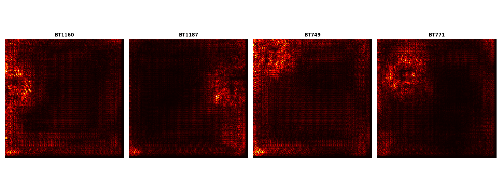

# 🧠 Saliency-Guided CNN for Brain Tumor Classification from Transcriptomic Images

## 🧠 Model Architecture and Training

### 🔧 Setup
- Framework: PyTorch
- Architectures:
  - [x] ResNet-18 (pretrained)
  - [x] EfficientNet-B0 (pretrained)
- Input Image Size: `128x128`
- Optimizer: `Adam`
- Loss Function: `CrossEntropyLoss`
- Batch Size: `32`
- Epochs: `5` (adjustable)
- Cross-Validation: `5-fold Stratified`


## 🧬 Datasets

- **GSE85217**  
  28 annotated brain tumor subtypes; preprocessed from `.h5ad`.

- **GSM3828672 Smartseq2 GBM**  
  GBM subtype expression profiles labeled via `tumour name`.

---

## ⚙️ Installation

You can install all dependencies using:
```bash
pip install -r requirements.txt
```

Clone the repo and install dependencies:

```bash
git clone https://github.com/alyatimi/Image-Based-Deep-Learning-for-Brain-Tumour-Transcriptomics.git
cd tumor-classification-cnn
pip install -r requirements.txt
```
## Saliency-Guided CNNs Visualisation

This section provides visual insights into the interpretability of our Saliency-Guided CNN models applied to brain tumour transcriptomic datasets.

### 1. Medulloblastoma Subtype Classification (GSE85217)

We generated class-wise saliency maps for each medulloblastoma subtype (WNT, SHH, Group3, Group4) using gradient-based visualisation techniques. These heatmaps highlight the regions (pixels) of the image most influential in the model’s prediction.

- **Saliency Maps per Subtype:**
### GSE85217 Saliency Maps
.

Each subplot corresponds to a specific medulloblastoma subtype, with brighter areas indicating stronger model attention on gene-derived image regions.

---

### 2. GBM Patient Classification (GSM3828672)

Similarly, saliency maps were generated to interpret the CNN model's predictions on heterogeneous single-cell transcriptomic data.

- **RGB vs Saliency Comparison:**


This figure shows an input RGB image (left) and its corresponding saliency map (right), highlighting important regions.

- **Per-Patient Saliency Maps:**


Each heatmap corresponds to a distinct patient/class in the GSM3828672 dataset.

---

### Purpose

These visualisations are crucial for:
- Enhancing model transparency and biological interpretability.
- Identifying key gene clusters that contribute to subtype-specific classification.


## CITATION 
