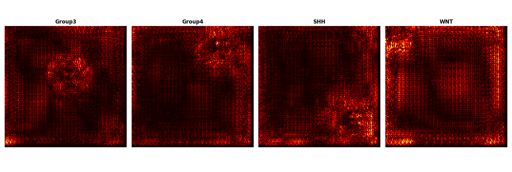
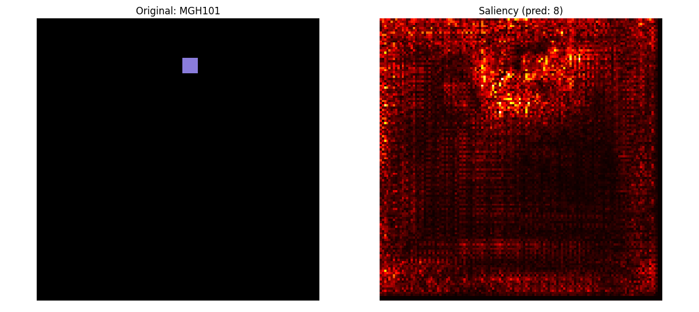
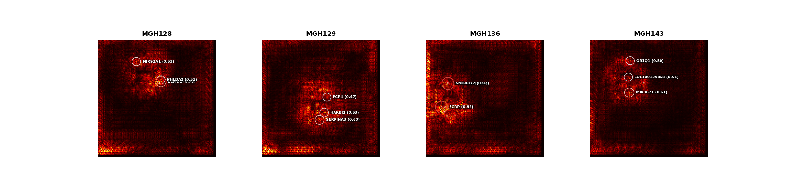
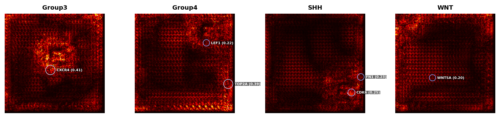

# 🧠 Saliency-Guided CNN for Brain Tumor Classification from Transcriptomic Images

##  Model Architecture and Training

### 🔧 Setup
- Framework: PyTorch
- Architectures:
  - [x] ResNet-18 (pretrained)
  - [x] EfficientNet-B0 (pretrained)
- Input Image Size: `128x128`
- Optimizer: `Adam`
- Loss Function: `CrossEntropyLoss`
- Batch Size: `32`
- Epochs: `5` (adjustable)
- Cross-Validation: `5-fold`


## 🧬 Datasets

- **GSE85217**  
  28 annotated brain tumor subtypes; preprocessed from `.h5ad`.

- **GSM3828672 Smartseq2 GBM**  
  GBM subtype expression profiles labeled via `tumour name`.

---

## ⚙️ Installation

You can install all dependencies using:
```bash
pip install -r requirements.txt
```

Clone the repo and install dependencies:

```bash
git clone https://github.com/alyatimi/Image-Based-Deep-Learning-for-Brain-Tumour-Transcriptomics.git
pip install -r requirements.txt
```
## Saliency-Guided CNNs Visualisation

This section provides visual insights into the interpretability of our Saliency-Guided CNN models applied to brain tumour transcriptomic datasets.

### 1. Medulloblastoma Subtype Classification (GSE85217)

We generated class-wise saliency maps for each medulloblastoma subtype (WNT, SHH, Group3, Group4) using gradient-based visualisation techniques. These heatmaps highlight the regions (pixels) of the image most influential in the model’s prediction.

- **GSE85217 Saliency Maps per Subtype:**

.
Each subplot corresponds to a specific medulloblastoma subtype, with brighter areas indicating stronger model attention on gene-derived image regions.

---

### 2. GBM Patient Classification (GSM3828672)

Similarly, saliency maps were generated to interpret the CNN model's predictions on heterogeneous single-cell transcriptomic data.

- **GSM3828672 RGB vs Saliency Comparison:**

.

This figure displays an input RGB image (left) and its corresponding saliency map (right), highlighting the most important regions.

- **GSM3828672 Cell type Saliency Maps:**


Each heatmap corresponds to a distinct cell type/class in the GSM3828672 dataset.

---
## 🔬 Saliency-Based Gene Attribution

We used saliency maps to visualise and interpret gene-level contributions to tumor classification made by our CNN model.

###  Tumor-wise Gene Contribution (GSE138794)

Each tumor sample was analysed using a ResNet-18 model, and saliency maps were generated to identify the most influential genes.  
The **top 3 genes** (saliency ≥ 0.2) per tumor are annotated on each image.  
Circle radius and color intensity correspond to saliency magnitude.



---

### 🧬 Subtype-Specific Gene Highlights (GSE85217)

Representative saliency maps from the four **medulloblastoma subtypes** (Group3, Group4, SHH, WNT) show subtype-enriched genes:

- **Group3**: `CXCR4` (0.41)  
- **Group4**: `TOP2A`, `LEF1`  
- **SHH**: `CDK6`, `FN1`  
- **WNT**: `WNT5A` (0.20)

These genes align with known markers, highlighting the model’s biological relevance.



---

The saliency-based visualisations provide interpretable insights into which genes are driving model decisions, supporting both validation and discovery of tumor-specific markers.

### Purpose

These visualisations are crucial for:
- Enhancing model transparency and biological interpretability.
- Identifying key gene clusters that contribute to subtype-specific classification.


## CITATION 

APA Style
Alyatimi, A., Chung, V., Iqbal, M. A., & Anaissi, A. (2025). Image-Based Deep Learning for Brain Tumour Transcriptomics: A Benchmark of DeepInsight, Fotomics, and Saliency-Guided CNNs. Machine Learning and Knowledge Extraction, 7(4), 119. https://doi.org/10.3390/make7040119
